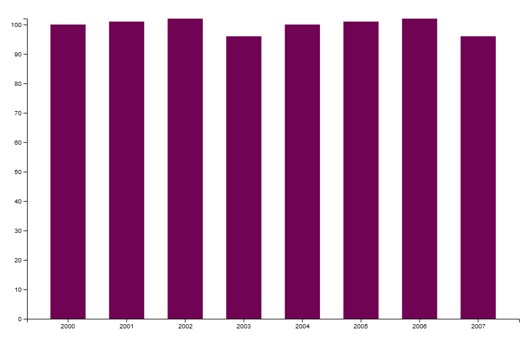

# Barchart

A simple barchart. To use with SAS Viya reports:

1. Add a Data Driven Content container
2. Set the URL option to [this](https://hannah-scott.github.io/D3.js/charts/d3-barchart.html)
3. Under _Roles_, add a categorical variable and a numerical variable. The categorical variable should be first in the list.

