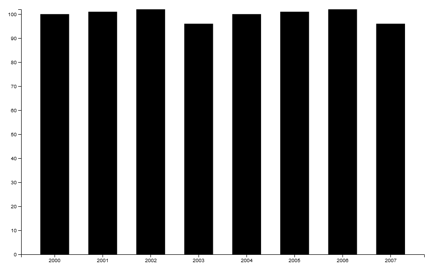

# Basics

## Getting started with D3.js and SAS Viya

In this article we're going to walk through how to build a simple bar chart in D3.js. We're going to use the `D3.csv` function to get a target format for our data. We're then going to look at SAS' example, pull out the refreshing code we need, and write a function to reformat SAS' data into the same format as `D3.csv`. 

At the end we'll have a basic barchart that you can host and point SAS at.

_**Note:** this tutorial assumes a basic knowledge of HTML + JS. No knowledge of D3.js is assumed._

## Building a chart with D3.js

### Setup

First things first, build a simple HTML page, pulling in the latest version of D3.js from their website and adding an SVG canvas.

```html
<!DOCTYPE html>
<html lang="en">
    <head>
        <meta charset="UTF-8">
        <meta name="viewport" content="width=device-width, initial-scale=1.0">
        <title>Simple barchart</title>

        <meta charset="utf-8">

        <script src="https://d3js.org/d3.v6.min.js"></script>
        
    </head>
    <body>
        <svg width="920" height="600"></svg>
    </body>
</html>
```

You can open this, but it won't display anything.

From my understanding (limited), D3.js is an abstraction of drawing on a normal SVG canvas. So rather than having to specify every detail about the circle you're going to draw, you can use a `circle` function that abstracts the detail out. It also has some nice functions for processing CSV data that we'll make use of.

So next, make a `barchart.js` file and include it in the body of your HTML page:

```html
...
    <body>
        <svg width="920" height="600"></svg>

        <script src="barchart.js"></script>
    </body>
...
```

### Barchart script

We'll go through building the `barchart.js` file in detail.

First, put your SVG canvas into a variable. Specify a `margin` variable that will apply some padding to our graph, and calculate the width and height that our final barchart will be.

```javascript
var svg = d3.select("svg"),
    margin = 100,
    width = svg.attr("width") - margin ,
    height = svg.attr("height") - margin;
```

Next, specify the scale we want to use for our X and Y axes. This is going to be a barchart with the bars on the X-axis, so we use `scaleBand` for the X-axis, with a padding of 0.4. This padding is the space between each bar. 

The Y-axis will be numeric, so we use `scaleLinear`.

```javascript
var xScale = d3.scaleBand().range ([0, width]).padding(0.4),
    yScale = d3.scaleLinear().range([height, 0]);
```

We're then going to append a `g` or 'group' element to our canvas, and offset it to give us some margin. 

It's much easier to put all our elements in a group and move the group, than it is to move all our elements individually.

```javascript
var g = svg.append("g")
       .attr("transform", "translate(" + margin/2 + "," + margin/2 + ")");
```

We're now ready to pull in some data and start building the chart.

### Pulling in data

Knowing nothing about what data D3 will like, let's pull in some using D3.js and have a look at it.

Thinking about our high-level design, we want to build a very basic barchart. What will our data look like?

We will need two columns. One of these will be a categorical variable, probably a string. The other will be some numerical value. For example:

|id|value|
|---|---|
1|10
2|11
3|8
4|9
5|10

D3 has a `csv` function that will load in data in the format that D3.js likes. Unfortunately the data has to be online somewhere. There's a CSV we can use in the Git repo for this tutorial.

`d3.csv` returns a `Promise` object, which is basically saying, "Trust me, when you need the data it'll be there."

We won't be using this for our SAS integration, so let's just use `console.log` to get a look at the data.

```javascript
d3.csv("https://raw.githubusercontent.com/hannah-scott/D3.js/main/tutorials/basics/data/basics.csv")
    .then(function(d) {
        console.log(d);
});
```


You'll get a message like this in your browser developer tools:
```javascript
(5) […]
0: Object { id: "1", value: "10" }
1: Object { id: "2", value: "11" }
2: Object { id: "3", value: "8" }
3: Object { id: "4", value: "9" }
4: Object { id: "5", value: "10" }
columns: Array [ "id", "value" ]
length: 5
<prototype>: Array []
```

So we can see that `D3.csv` returns an array of objects. Each object in the array is a single _row_ of our data. Each row is stored as a dictionary, where the keys are column headers and the values are just the value for that column.

This is our target format. We want to write a function that takes in SAS' data and returns it in this format. Now we need to find out what format SAS sends data in.

## SAS data reformatting

**INSERT INFORMATION ABOUT SAS EXAMPLE HERE**

```javascript
var sampleData = {data:[
    ["2000", 100],
    ["2001", 101],
    ["2002", 102],
    ["2003", 96],
    ["2004", 100],
    ["2005", 101],
    ["2006", 102],
    ["2007", 96]
]};

var sampleColumnInfo = [
    {label: "year", type: "string"},
    {label: "value", type:"number"}
];
```

To reformat this data, we need to:

1. Get our column names and data
2. For each row of data, create a dictionary mapping column names to values
3. Append each of these dictionaries to an array
4. Return the array

```javascript
function formatSASData(c, d) {
    // Create container array
    var arr = []

    for(i=0; i < d.data.length; i++) {
        var row = d.data[i]
        var row_dict = new Object;

        // Map column name to value
        for (j=0; j < row.length; j++) {
            row_dict[c[j].label] = row[j];
        }

        // Append row to container array
        arr.push(row_dict);
    }

    return arr
}
```

We can now test this:

```javascript
console.log(formatSASData(sampleColumnInfo, sampleData));
```

```javascript
(8) […]
0: Object { year: "2000", value: 100 }
1: Object { year: "2001", value: 101 }
2: Object { year: "2002", value: 102 }
3: Object { year: "2003", value: 96 }
4: Object { year: "2004", value: 100 }
5: Object { year: "2005", value: 101 }
6: Object { year: "2006", value: 102 }
7: Object { year: "2007", value: 96 }
length: 8
<prototype>: Array []
```

Success! Let's build a chart!

## Building the chart

We're going to build our chart in the following steps:

1. Teardown the old chart. This is helpful if we're applying a filter to our data in SAS Viya: we want to redraw the axes each time, not leave the old ones on the screen
2. Scale our axes to the data
3. Draw the X and Y axes
4. Draw the bars at the right height

We're going to do this all in a function.

First, set up a function and define some label variables for readability.

```javascript
function drawBarchart(columnInfo, data) {
    var xLabel = columnInfo[0].label,
        yLabel = columnInfo[1].label;
```
Next we're going to tear down the old chart, add a new group and scale our X and Y axes. Our Y axis will start at 0. If you wanted to change this, you can just tweak the first value in the `domain` function.

```javascript
    svg.selectAll('*').remove();

    var g = svg.append("g")
        .attr("transform", "translate(" + margin/2 + "," + margin/2 + ")");

    xScale.domain(data.map(function(d) {
        return d[xLabel];
    }));
    yScale.domain([
        0,
        d3.max(data, function(d) {return d[yLabel];})
    ]);
```

Now we'll draw our X and Y axes:
```javascript
    // Draw axes
    g.append("g")
    .attr("transform", "translate(" + 0 + "," + height + ")")
    .call(d3.axisBottom(xScale).tickFormat(function(d){
        return d;
        }).ticks(10))
        .enter()
        .append("text")
        .attr("x", 6)
        .attr("dx", "0.71em")
        .attr("text-anchor", "end")
        .text(xLabel);

    g.append("g")
    .call(d3.axisLeft(yScale).tickFormat(function(d){
        return d;
        }).ticks(10))
        .enter()
        .append("text")
        .attr("y", 6)
        .attr("dy", "0.71em")
        .attr("text-anchor", "end")
        .text(yLabel);
```

Finally, draw our bars and close off the function:

```javascript
    // Draw bars
    g.selectAll(".bar")
        .data(data)
        .enter().append("rect")
        .attr("class", "bar")
        .attr("x", function(d) { return xScale(d[xLabel]); })
        .attr("y", function(d) { return yScale(d[yLabel]); })
        .attr("width", xScale.bandwidth())
        .attr("height", function(d) { return height - yScale(d[yLabel]); });
};
```

Let's test this out: manually set the datasets at the bottom of your `barchart.js` file and open up the HTML file in a browser.

```javascript
results = sampleData;
columnInfo = sampleColumnInfo;
data = formatSASData(columnInfo, results);
drawChart(columnInfo, data);
```

You should get something like this:



_**Note:** The code up to this point is included in the code directory._

## SAS listener

This final bit is lifted from SAS' example code again. We want to add a function that loads SAS data when it's supplied, and a listener to call that function.

First, the function to load SAS data.

```javascript
var self = this;

// Retrieve data and begin processing
function onMessage(evt) {
    // Check if event has happened and if data was sent
    if (evt && evt.data) {
        var results = null;
        var columnInfo = null;

        self.resultName = evt.data.resultName;

        // If there is any data or data has changed, load it and draw chart
        if (evt.data.availableRowCount >= 0 || evt.data != results) {
            results = evt.data;
            columnInfo = evt.data.columns;
        }
        // Otherwise, load sample data
        else if (evt.data.availableRowCount == -1) {
            results = sampleData;
            columnInfo = sampleColumnInfo;
            
        }
        // Format data and draw chart
        data = formatSASData(columnInfo, results);
        drawChart(columnInfo, data);
    }
}
```

And the listener.

```javascript
// Fetch data and run process
if (window.addEventListener) {
    // For standards-compliant web browsers
    window.addEventListener("message", onMessage, false);
} else {
    window.attachEvent("onmessage", onMessage);
}
```

Comment out the manually set datasets, and you're ready to point SAS at the chart!
